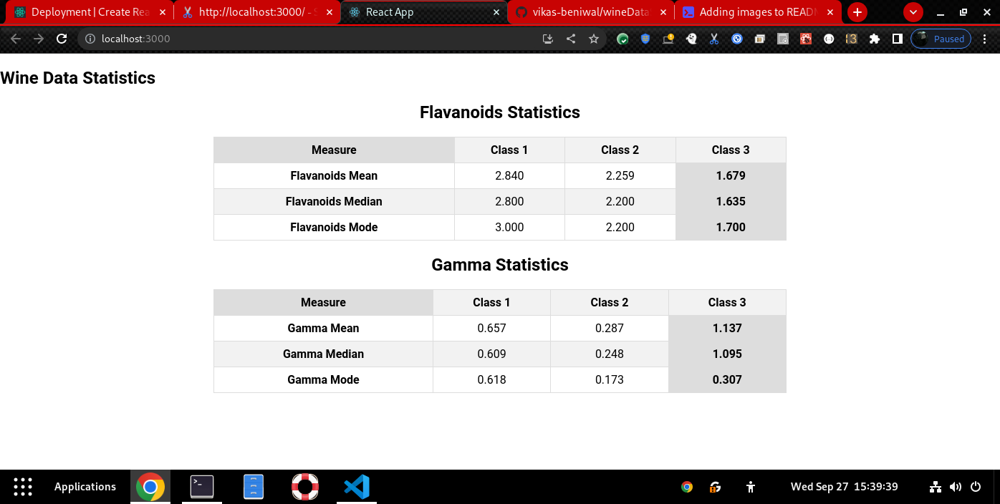
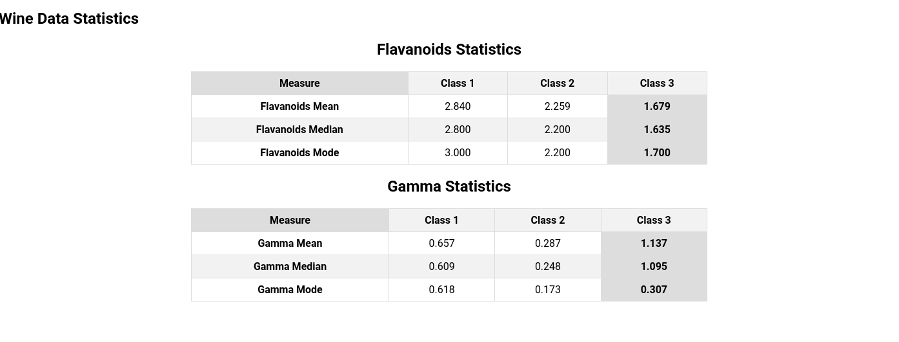

# Getting Started with Create React App

This project was bootstrapped with [Create React App](https://github.com/facebook/create-react-app).

# Wine Data Statistics

This is a React-based web application that calculates statistics for wine data, specifically for the "Flavanoids" and "Gamma" properties. The application displays mean, median, and mode statistics for these properties across different classes of wine.

## Getting Started

Follow these instructions to get a copy of the project up and running on your local machine.

### Prerequisites

Before you begin, ensure you have the following software installed:

- [Node.js](https://nodejs.org/): You need Node.js to run the application.

### Installing

1. Clone the repository to your local machine:

   ```bash
   git clone https://github.com/vikas-beniwal/wineDataStastics.git

2. Navigate to the project directory:

   ```bash
     cd wineDataStastics

3. install project dependencies using Yarn:

   ```bash
      yarn install

3. Running the Application Now that you have installed the dependencies, you can run the application:

   ```bash
      yarn start

### Output
        
        
        

        

4. ### Usage
       The application displays statistics for two properties: "Flavanoids" and "Gamma."
       Statistics are calculated for different classes of wine.
       You can view the mean, median, and mode statistics for each property and class.

5. ### Contributing
       If you'd like to contribute to this project, please follow these guidelines:

6. Fork the repository on GitHub.
    Create a new branch with a descriptive name for your feature or bug fix.
    Make your changes and commit them with clear messages.
    Push your branch to your fork on GitHub.
    Create a pull request to merge your changes into the main repository.
    License
    This project is licensed under the MIT License - see the LICENSE.md file for details.

### Acknowledgments
Special thanks to the creators of React for providing a powerful framework.
Thanks to the community for contributing to open-source software.
